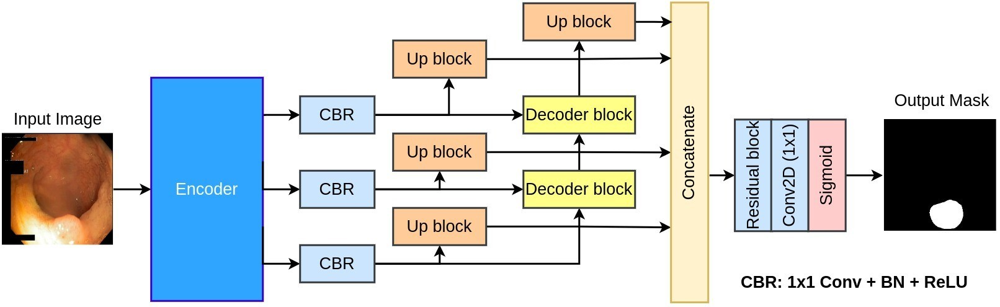
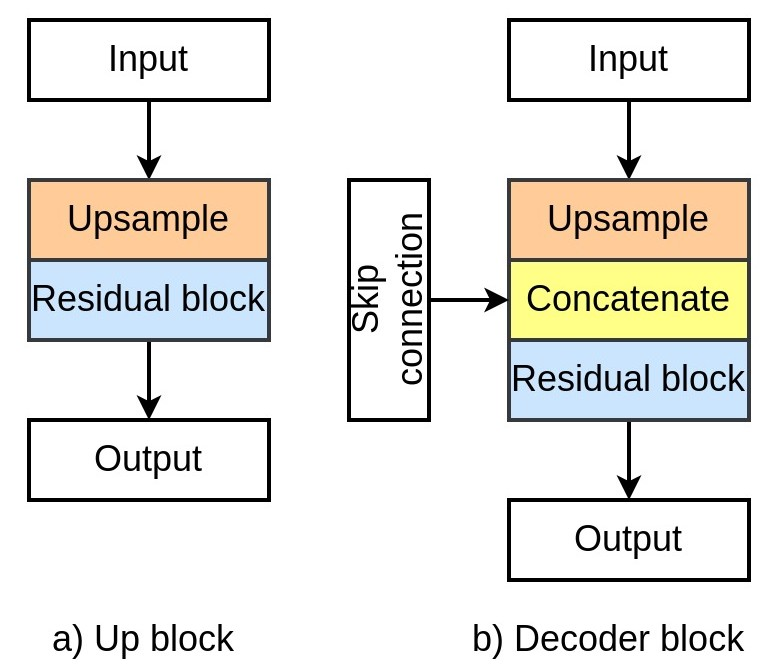
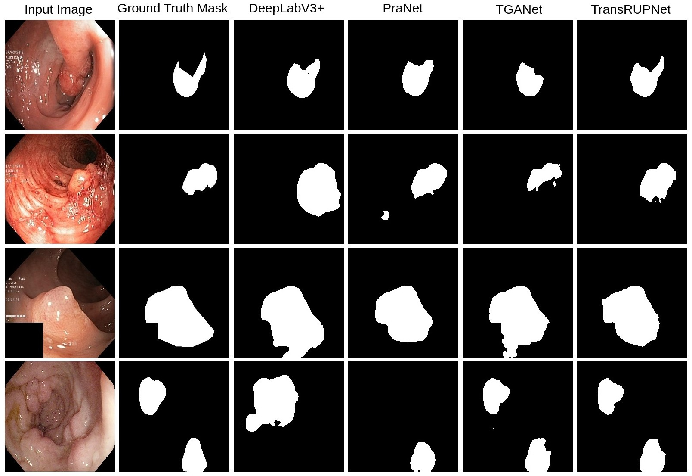
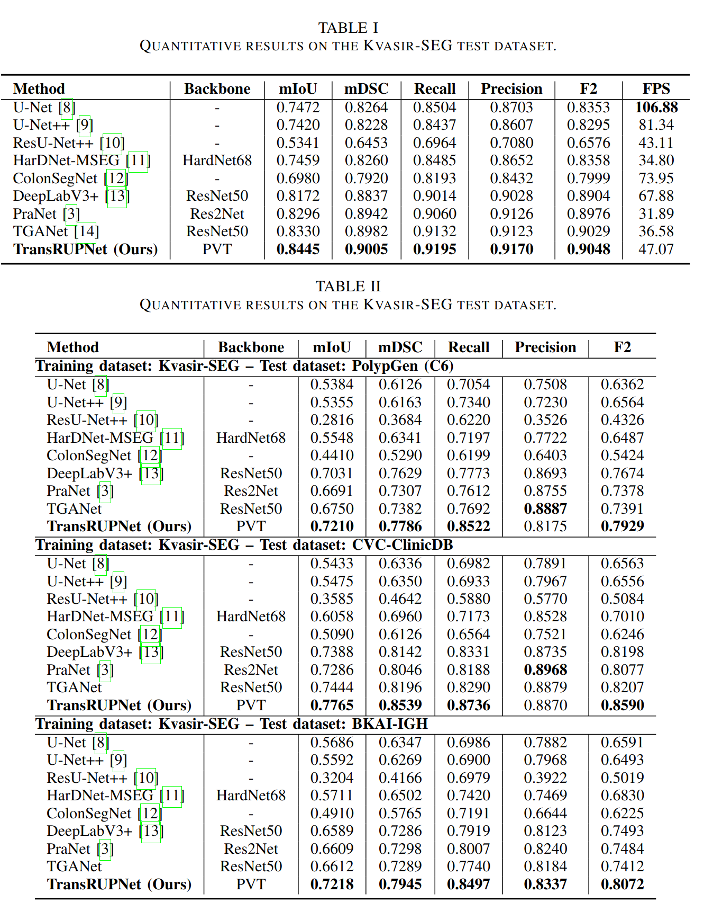

# TransRUPNet for Improved Out-of-Distribution Generalization in Polyp Segmentation

## Overview
 We develop a novel real-time deep learning-based architecture, TransRUPNet, that is based on a Transformer and residual upsampling network for colorectal polyp segmentation to improve OOD generalization. The proposed architecture, TransRUPNet, is an encoder-decoder network that consists of three encoder blocks, three decoder blocks, and some additional upsampling blocks at the end of the network. With the image size of $256\times256$, the proposed method achieves an excellent real-time operation speed of **47.07 frames per second** with an average **mean dice coefficient score of 0.7786 and mean Intersection over Union of 0.7210** on the out-of-distribution polyp datasets. The results on the publicly available PolypGen dataset (OOD dataset in our case) suggest that TransRUPNet can give real-time feedback while retaining high accuracy for in-distribution datasets. Furthermore, we demonstrate the generalizability of the proposed method by showing that it significantly improves performance on OOD datasets compared to the existing methods.

## Architecture

##Key features
**Encoder-Decoder Structure:** It consists of three encoder blocks, three decoder blocks, and additional upsampling blocks.

**Use of Pyramid Vision Transformer (PVT):** The network begins with a PVT as a pretrained encoder, which helps in extracting various feature maps.

**Feature Map Processing:** The extracted feature maps are reduced and passed through up blocks and decoder blocks, involving bilinear upsampling and residual blocks for robust representation learning.

**Output Generation:** The outputs from the up blocks are concatenated into a single feature map, followed by a residual block, 1x1 convolution, and a sigmoid activation to generate the final segmentation mask.

**Performance Metrics:** TransRUPNet demonstrated impressive real-time operation speed and accuracy, with significant performance improvements on OOD datasets compared to existing methods.

 

## Datasets:
The following datasets are used in this experiment:
<ol>
  <li>Kvasir-SEG (https://datasets.simula.no/kvasir-seg/)</li>
  <li>[Polypgen] (https://drive.google.com/drive/u/1/folders/16uL9n84SrMt7IiQFzTUQNaJ9TbHJ8DhW)</li>
  <li>[BKAI-IGH] (https://paperswithcode.com/dataset/bkai-igh-neopolyp-small)/li>
 </ol>

## Results

 

 

## Citation
Please cite our paper if you find the work useful: 
<pre>
@article{jha2023transrupnet,
  title={TransRUPNet for Improved Out-of-Distribution Generalization in Polyp Segmentation},
  author={Jha, Debesh and Tomar, Nikhil Kumar and Bagci, Ulas},
  journal={arXiv preprint arXiv:2306.02176},
  year={2023}
}
</pre>

## Contact
please contact debesh.jha@northwestern.edu for any further questions. 

